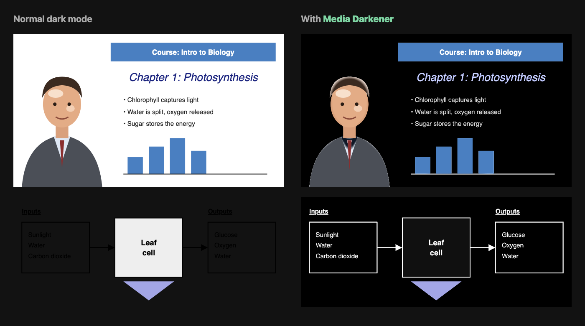

# media-darkener

Dark mode stops at text. You turn it on, the page goes dark, and then:

- A lecture video fills the screen with a blinding white slide.
- A diagram with a transparent background shows black text on a black page, so you can't read it.
- Tools like Dark Reader only offer a whole-page invert, which inverts every photo and every face along with the page.

Turning dark mode off isn't a fix either, because then the whole page goes white.

**media-darkener is one button you click to fix this.** Click it on any page and bright image and video backgrounds turn dark, and the text on them turns light. Unlike tools that invert whole images or videos, it inverts only the bright background, so faces and photos keep their natural colours. Click again to switch it off.

## Install

### Extension (recommended)

Adds a floating toggle button to every page (bottom right; drag it anywhere, the position is remembered), a toolbar icon that toggles too, plus a keyboard shortcut (`Alt+Shift+D`, change it at `chrome://extensions/shortcuts`). On/off is remembered per site.

1. Open `chrome://extensions` (or `brave://extensions`) and turn on **Developer mode**.
2. Click **Load unpacked** and pick the `extension` folder.

When loaded this way it reloads itself within about 30 seconds of a file change; refresh open tabs to pick up the new version.

### Bookmarklet

No install, but you click it again after every page load.

1. Open `index.html` in your browser.
2. Drag the **Media Darkener** link to your bookmarks bar.

It works in Chrome, Brave and other Chromium browsers, including on sites with strict security policies such as YouTube.

## How it works

An SVG filter applied to `img`, `video`, `iframe` and background-image elements:

1. Flatten transparency onto white, so dark text on transparent PNGs counts as foreground.
2. Mask pixels that are bright and not warm (`luma - 1.5 * max(R - B, 0)` above ~0.78), so skin highlights are skipped.
3. Blur the mask and keep only areas that are mostly bright. Dark text inside a white slide is included; white text on an already-dark image, or a small highlight, is not.
4. Inside those areas flip only paper (very bright) and ink (very dark) pixels, so mid-tone colours such as chart bars and skin stay as they are.
5. Invert (plus 180° hue rotate to keep colours) only inside the mask.

Some sites (Facebook, for example) fill the space around an image with a CSS background taken from its edge colour. A bright box that frames an image or video like that gets a black background too.

Tuning knobs live in `invert()` in `extension/media-darkener.js`: threshold (`slope`/`intercept`), warm penalty (`-1.5`), blur `stdDeviation`, density threshold.

## Limits

- Images with a dark background are left as they are. Only bright or transparent backgrounds are inverted.
- Strongly tinted light backgrounds (yellow, peach) are not inverted; cream and off-white are.
- Elements added after clicking are covered; iframes are filtered as a whole.

The demo image is rendered from `docs/demo.html` with the real filter.
